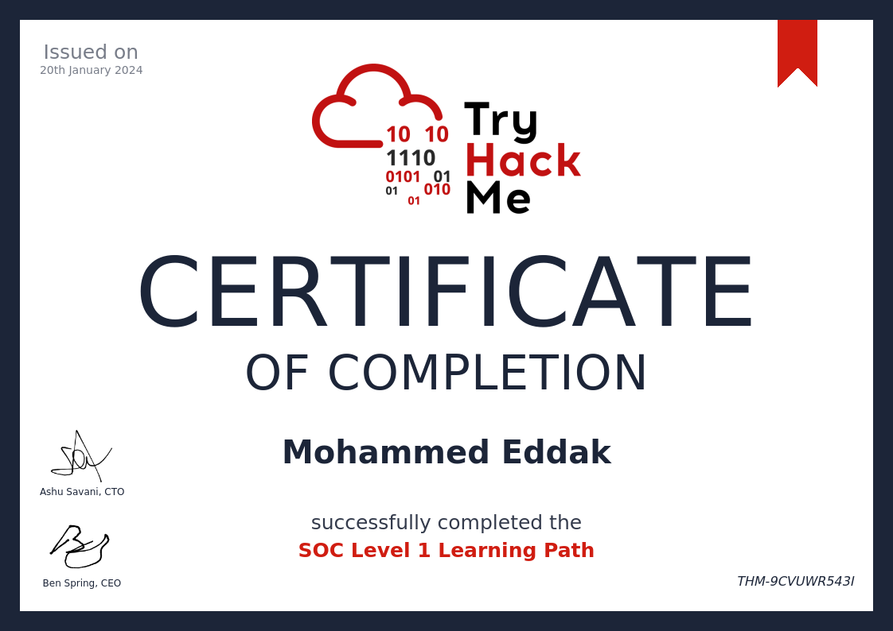
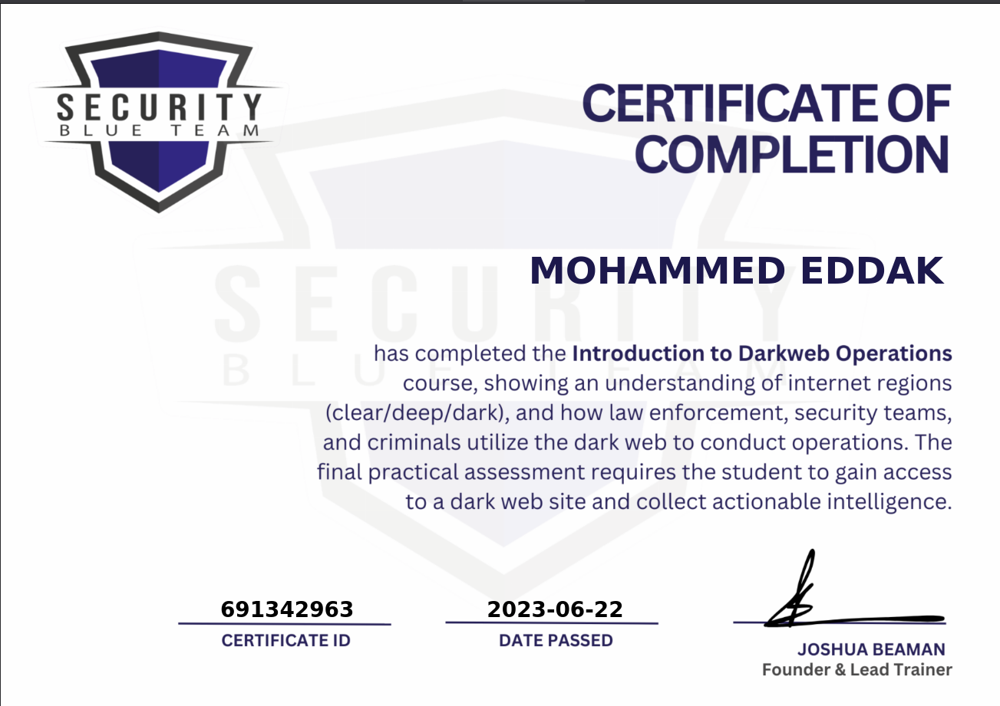

# About Me

Hi, I'm M. Said Eddak, a passionate and meticulous cybersecurity enthusiast. My goal is to help creating a more secure world !

## Main Cyber Security Interests 
My main interests gravitate around the Blue Teaming field :
- SoC Operations
- Cryptography
- Forensics
- Reverse Engineering
- Networks

## Building my knowledge
I leverage different online plateforms to extend my knowledge of the above mentionned fields.
The main ones are TryHackMe, HackTheBox, Cryptohack, ... as well as different github/forums in order to build a solid fundation.

I also learn a lot of new things by participating to online CTFs.


## Certifications
Following are the (free) certifications that I have :



<!-- ## Projects

- [Project 1](https://project1.com)
- [Project 2](https://project2.com)

---
title: "Advanced Post Example"
date: 2023-06-21
author: "Your Name"
tags: ["Hugo", "PaperMod", "Tutorial"]
categories: ["Tutorials"]
---

## Introduction

Welcome to the advanced post example!

## Code Example

Here's a code snippet in Go:

```go
package main

import "fmt"

func main() {
    fmt.Println("Hello, world!")
}
```

## Table Example

Here's a table example:

| Header 1 | Header 2 |
| -------- | -------- |
| Cell 1   | Cell 2   |
| Cell 3   | Cell 4   |

## Image Example

Here's an image example:


 -->